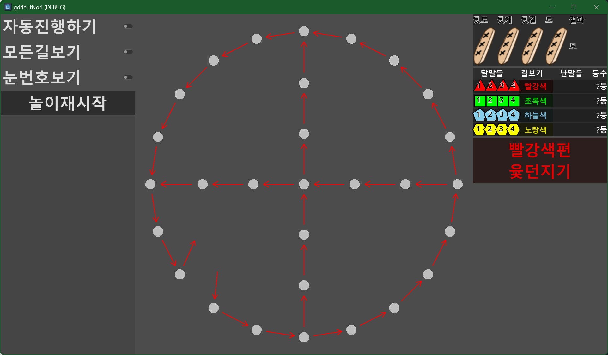

# godot 4 로 만드는 윷놀이 

## 윷(Yut)

말을 이동하기 위한 수치를 얻기 위해 던지는 반원(배면과 등면으로 구성) 기둥 

## 말의 이동 

4개를 사용하여 도 개 걸 윷 모 (백도) 의 5개(6개)값을 만들어 낸다. 

    도 : 1칸 앞으로 이동 : 배면 1개 등면 3개 
    개 : 2칸 앞으로 이동 : 배면 2개 등면 1개 
    걸 : 3칸 앞으로 이동 : 배면 3개 등면 2개 
    윷 : 4칸 앞으로 이동 : 배면 4개 등면 1개 : 한번 더 윷을 던질 수 있다.
    모 : 5칸 앞으로 이동 : 배면 0개 등면 4개 : 한번 더 윷을 던질 수 있다.
    백도 : 1칸 뒤으로 이동 : 배면에 특수 표시된 윷 하나만 배면인 도 

    이동은 반드시 나온 값 만큼 이동해야 한다. 
    한번 던저 나온 이동 수치를 여러 말에 나누어 쓸 수 없다. 

    이동은 반시계 방향으로 한다. 

## 판(pan)

말을 놓아 이동하는 바닥, 눈이 위치하고 있다. 
## 판의 모양

    ( ) - ( ) - ( )  -  ( ) - ( ) - ( )
     |  \                         /  |
    ( )  ( )                   ( )  ( )
     |      \                 /      |
    ( )      ( )           ( )      ( )
     |          \         /          |
     |            \     /            |
     |              ( )              |
     |            /     \            |
     |          /         \          |
    ( )      ( )           ( )      ( )
     |      /                 \      |
    ( )  ( )                   ( )  ( )
     |  /                         \  |
    ( ) - ( ) - ( )  -  ( ) - ( ) - ( )

## 눈(nun)

판 위에 표시되어 말의 이동 위치를 표시하는 것.

## 말(mal) 

윷판 위에 눈을 따라 이동하는 것

편이 가지고 있는 말이 모두 먼저 나면 놀이에 이기게 된다. 

보통 한편당 4개의 말을 가지고 시작한다. 

## 승리 조건 

4개의 편(team) 이 4개의 말을 가지고 윷을 던저 나온 값 만큼씩 말을 이동하며, 

출발점에서 시작하며 종료 지점까지 4개의 말을 모두 이동시키면(나면) 놀이에 이기게 된다. 

## 특이한 규칙들 

    판 위에 말이 하나도 없는 상태에서 백도가 나오면 말을 올리지 못한다. 
    말이 시작점기준 도 위치에있는데  백도가 나오는 경우 로컬룰들이 많이 있다. 
    같은 편 의 두 말이 같은 눈 위치에 놓일 경우 업게 된다. 
    업은 말들은 마치 하나의 말인 것 처럼 이동할 수 있게 된다. 
    다른 편 말이 같은 눈위에 놓이게 된 경우 새로 눈에 들어오는 말이 기존의 말을 잡게 된다. 
    잡힌 말은 판에서 나와서 처음부터 새로 놓기 시작해야 한다. 
    판위에 갈림길 눈에 멈춘 경우 다음 순서에 지름길로 갈 수 있다.
    갈림길에 멈추지 못한 경우 먼길로 가야 한다. 
    윷이나 모로 말을 잡는 경우 두번 더 던질 수 있지 않고 한번만 더 던질수 있다. 
    갈림길 눈에 멈춘 상태에서 백도가 나온 경우 다음 순서에 지름길로 가려면 다시 갈림길 눈에 멈출 수 있어야 한다. 

## 여기서의 변형 규칙들 

    각 편(team)별로 시작 위치를 다르게 해본다. 
    편 별로 시작 모퉁이가 다르다. 
    편 별로 시계방향 이동과 반시계 방향 이동으로 다르게 한다. 
    백도와 별개로 백개와 백걸을 추가해본다. 
    백도는 4가지 도의 경우중 백도 배면이 나오는 1가지가 백도가 된다.
    배면에 백도표시인 윷 이외에 백개나 백걸이 될수 있는 보조백 표시를 해서 
    백도 + 보조백 배면이 나온 경우만 백개 ( 보조백 배면만 나오면 그냥 개로 취급)
    (6가지 경우의 수중 2경우)
    백도 + 2 보조백 배면이 나오면 백 걸로 취급한다. (4종의 걸 경우중 1가지만 백걸)
    백도는 도중 1/4 가 백도 
    백개는 개중 1/3 가 백개 
    백걸은 걸중 1/4 가 백걸